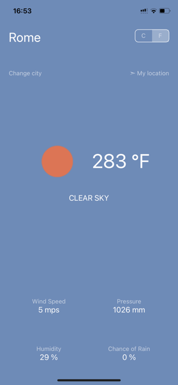

# Weather-App

Мини приложение с информацией о погоде.

# Стек технологий:
* Expo + React Hooks
* TypeScript
* Redux Toolkit + RTK Query
* UI Kitten

# Как запустить:
* Склонировать репозиторий
* Установить зависимости `npm install`
* Запустить приложение `npm start`
* Для запуска на Android/IOS устройстве необходимо установить Expo Go приложение из Google Play Store/Apple App Store (IOS [https://apps.apple.com/us/app/expo-go/id982107779](https://apps.apple.com/us/app/expo-go/id982107779), Android [https://play.google.com/store/apps/details?id=host.exp.exponent&hl=ru&gl=US](https://play.google.com/store/apps/details?id=host.exp.exponent&hl=ru&gl=US))
* Запустить приложение на устройстве, отсканировав QR код, который появится в консоли после запуска `npm start`
* Далее приложение будет доступно в Expo Go приложении для Android/IOS

Приложение использует API [https://openweathermap.org/api](https://api.rawg.io/docs/). 
